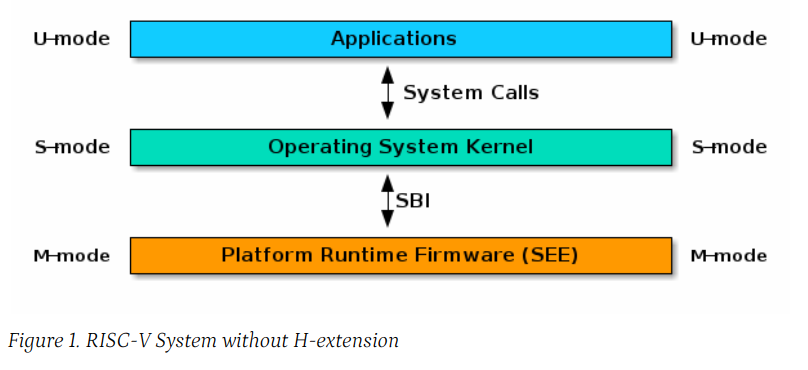
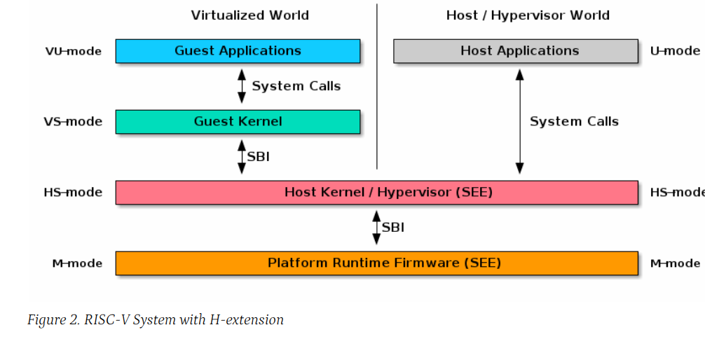
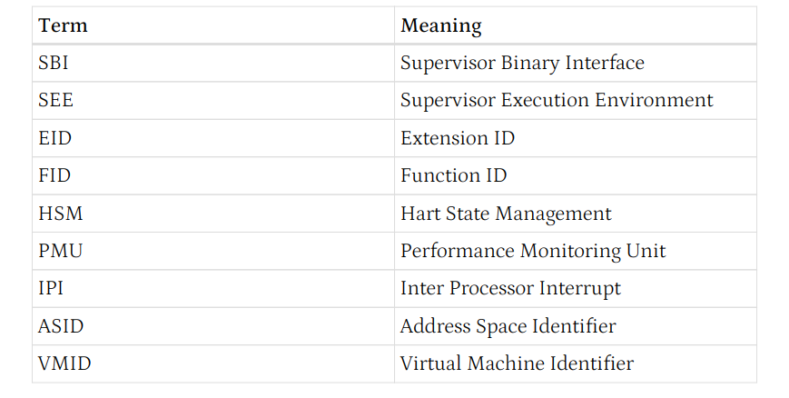
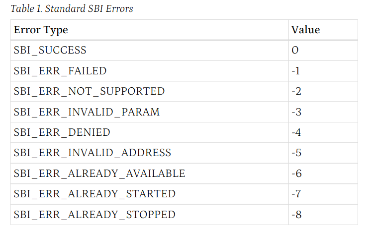
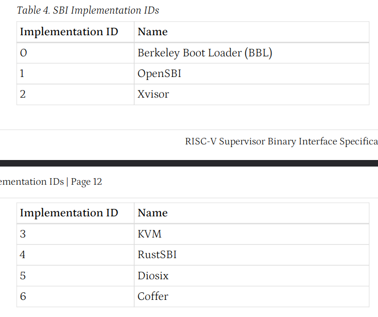
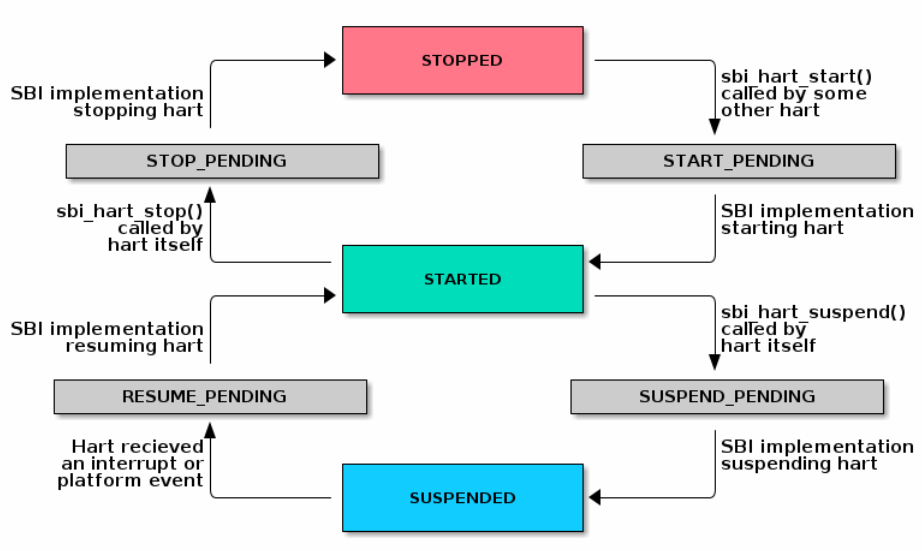
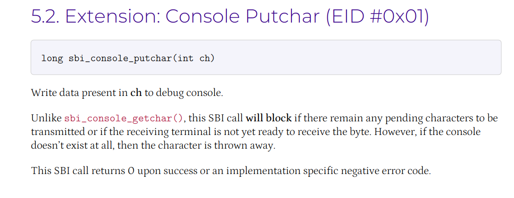
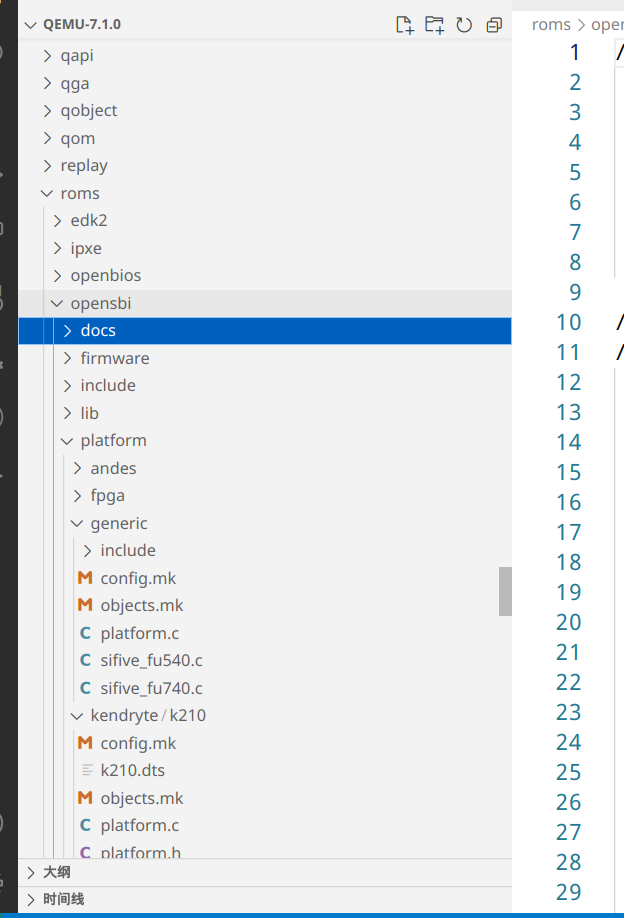

### 1.SBI的定位

SBI：Supervisor Software Binary Interface 软件二进制接口

SBI的位置：如果有Hypervisor，可以通过Hypervisor提供SBI；如果没有Hypervisor，则通过

Machine Mode的固件提供SBI。





需要注意：The SBI specification doesn’t specify any method for hardware discovery. The supervisor software must rely on the other industry standard hardware discovery methods (i.e. Device Tree or ACPI) for that. SBI 不提供设备发现功能，内核必须诉诸Device Tree来实现设备的发现。

### 2.SBI的相关概念



### 3.调用二进制约定

* `a7` 储存SBI扩展的ID
* `a6` 存储SBI扩展中某个SBI函数的ID
* 使用 `ECALL` 发起一个调用
* 除了 `a0` 和 `a1`，其他的寄存器都由被调用者维护
* 返回值：`a0` = 错误码, `a1` = 返回值

标准的返回值如下表：



* 对于要求传入hard编号mask（就是一个hart的列表）的函数，需要传入以下两个参数：

  `unsigned long hart_mask`: 位向量，描述此次操作选中了哪些hart

  `unsigned long hart_mask_base`: hart_mask编码的第一个hart的编号。用于要求的hart数目超过hart_mask的情况。比如说，hart_mask_base=2, 那么hart_mask就编码 `2~65` 这64个核是否被选中。

  hart_mask_base置为`-1` 表示选中所有hart

### 4.基本扩展(EID=0x10)

* sbi_get_spec_version: 获取SBI实现的版本号

* sbi_get_impl_id: 获取SBI实现的id，这在不同的SBI实现中不同

* sbi_get_impl_version：获取SBI实现的版本

* sbi_probe_extension(long extension_id): 探测某个extension是否可用

* sbi_get_mvendorid(void): 获得设备制造商的id，存储于mvendorid

  

SBI 实现的ID列表：



### 6.Timer Exception时钟扩展

* sbi_set_timer(uint64_t stime_value)：编程下一个时钟中断在`stime_value`（单位未知）时间之后发生。此函数会清空当前的pending timer interrupt位。(`sip`)

  如果Supervisor希望清除计时器中断而不调度下一个计时器事件，它可以无限远地请求一个计时器中断(即(uint64 _ t)-1) ，或者它可以通过清除 sie.STIE CSR 位来屏蔽计时器中断。

### 7.IPI扩展（核间中断）

* ```c
  struct sbiret sbi_send_ipi(unsigned long hart_mask,
                             unsigned long hart_mask_base)
  ```

  向hart_mask定义的核发送核间中断(IPI)

### 8.远程FENCE指令扩展

The remote fence function acts as a full TLB flush if

* start_addr and size are both 0
* size is equal to 2^XLEN-1

* ```c
  struct sbiret sbi_remote_fence_i(unsigned long hart_mask,
                                   unsigned long hart_mask_base)
  ```

  指示远程 Hart 执行 FENCE.I 指令（内存屏障，保证fence.I之前的所有load和store都已经完成）

* ```c
  struct sbiret sbi_remote_sfence_vma(unsigned long hart_mask,
                                      unsigned long hart_mask_base,
                                      unsigned long start_addr,
                                      unsigned long size)
  ```

  指示远程Hart执行SFENCE.VMA指令，刷新TLB表项，刷新的虚拟地址范围位`start_addr` 到`start_addr + size` 的这一段

  

* ```c
  struct sbiret sbi_remote_sfence_vma_asid(unsigned long hart_mask,
                                           unsigned long hart_mask_base,
                                           unsigned long start_addr,
                                           unsigned long size,
                                           unsigned long asid)
  ```

  指示远程 Hart 对指定的ASID做TLB刷新。

* 其他的Function涉及对Hypervisor的操作，不做讨论。

### 9.Hart状态管理扩展

Hart 状态管理(HSM)扩展引入了一组Hart状态和一组功能，允许Supervisor模式软件请求Hart状态更改。

初始时只启动Hart 0，其余的核需要调用hart_start自行启动。

下面是Hart状态转换状态机：



支持的函数：


### 10.Legacy SBI Call




（上述两个尚未被启用，其余的已被弃用）


OpenSBI 在 Qemu中的位置：


